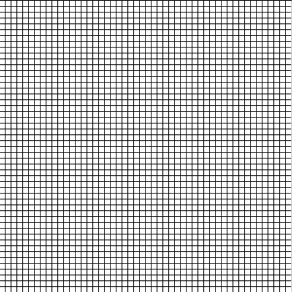

# GOL-GMG 
## Game Of Life - Generative Music Generator
GOL-GMG is a Javascript application that implements the Game Of Life rules.  
Make generative-music using web-based GUI.

---

---

# RUN LOCALLY

Go into the project directory `cd generative-music-generator`   
Run a local server `python3 -m http.server 8080`   
In your browser go to http://localhost:8080  

---

# INFO

More info about [The Game Of Life](https://en.wikipedia.org/wiki/Conway%27s_Game_of_Life)  

What is [Generative music](https://en.wikipedia.org/wiki/Generative_music)  

[Example](https://www.youtube.com/watch?v=WbJlR77WWic) of Generative Music using the Game Of Life

---

# TODO

- Improve generation algo;
- Improve rendering performance; 
- Make the canvas smoother;